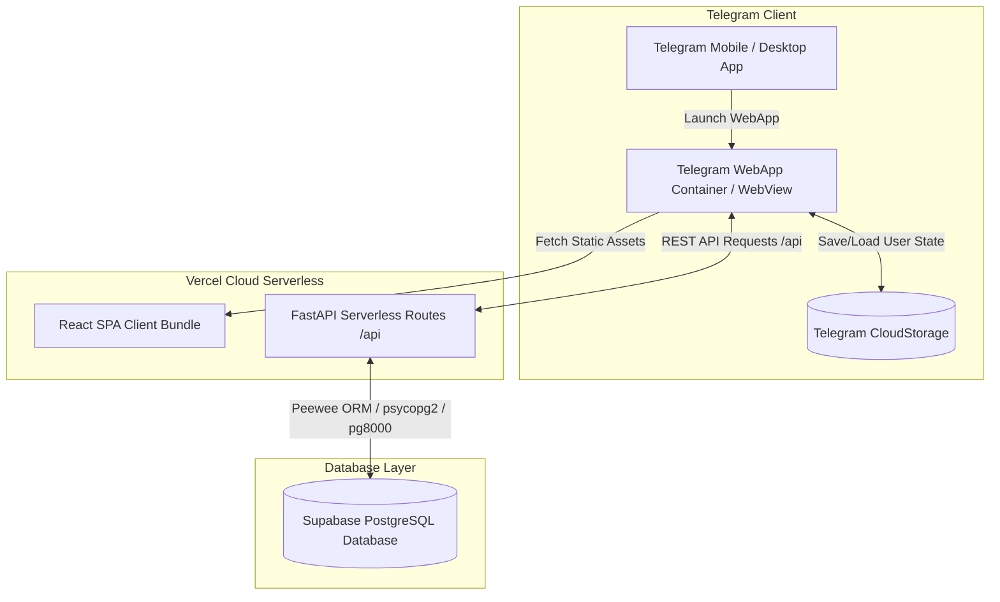

# 🏗 Архитектура системы Lerne TMA

В данном документе подробно описана архитектура бэкенда, фронтенда, организация базы данных и взаимодействия элементов приложения **Lerne TMA**.

---

## 📐 Общая схема архитектуры

---

## 🛠 Компоненты системы

### 1. Фронтенд (React 18 + Vite)
Расположение: `app/`
- **Фреймворк**: React 18 с вызовом Vite в качестве сборщика.
- **Управление состоянием**: Таблица хранилищ Zustand:
  - `useDeckStore.js` — загрузка, фильтрация и управление колодами/карточками.
  - `useLanguageStore.js` — активный целевой язык, состояние выбора языка и открытие модального окна.
  - `useUiStore.js` — визуальное состояние UI (активные вкладки, профиль, туториалы, тосты).
  - `useSettingsStore.js` — пользовательские и административные настройки ИИ-генерации.
- **Анимации и Стиль**: Vanilla CSS со стеклянным дизайном (Glassmorphism), Framer Motion для карточек с 3D-переворотом и плавных переходов.

### 2. Бэкенд (FastAPI + Peewee ORM)
Расположение: `api/`
- **Фреймворк**: FastAPI для быстрой асинхронной обработки HTTP REST API.
- **ORM**: Peewee ORM для работы с PostgreSQL.
- **Драйверы подключения к БД**:
  - `psycopg2-binary`: Основной высокопроизводительный драйвер.
  - `pg8000`: Чистый Python-драйвер для отказоустойчивой работы в бессерверных контейнерах Vercel.
- **Роутеры API**:
  - `/api/init` — консолидированный эндпоинт загрузки всех начальных данных в 1 запрос.
  - `/api/auth/*` — синхронизация пользователей Telegram и ведение сессий.
  - `/api/decks/*`, `/api/cards/*` — операции над колодами и карточками.
  - `/api/study/*` — интервальное повторение (SM-2 алгоритм).
  - `/api/settings/*` — пользовательские и глобальные промпты ИИ.

### 3. База данных (Supabase PostgreSQL)
- **Основная БД**: Хостится на Supabase Cloud (PostgreSQL 15+).
- **Схема таблиц**:
  - `tma_user`: Профиль пользователя Telegram, сохраненный активный язык (`active_language`) и флаг прохождения выбора языка (`has_selected_language`).
  - `tma_deck`: Колоды пользователя с привзякой к языку (`target_language`), позиции, статусу закрепления (`is_pinned`) и папке (`folder_id`).
  - `tma_card`: Карточки (лицевая сторона `front_text`, обратная `back_text`, аудио, изобажения, флаги).
  - `tmaprogress`: Прогресс повторения каждой карточки по алгоритму SM-2 (`ease_factor`, `interval`, `repetitions`, `next_review`, `queue`).
  - `tma_folder`: Папки для группировки колод с фильтрацией по целевому языку.
  - `tma_custom_prompt`: Пользовательские промпты ИИ для генерации примеров и контекста.

---

## ⚡ Развертывание (Vercel Serverless)

Приложение автоматически деплоится в Vercel:
- **Маршрутизация**: `vercel.json` перенаправляет все вызовы `/api/*` на точка входа `api/index.py`.
- **Ленивое подключение**: Инициализация базы данных происхдоит без накладных TCP-блокировок при импорте, что исключает таймауты при "холодном старте" функций Vercel.
