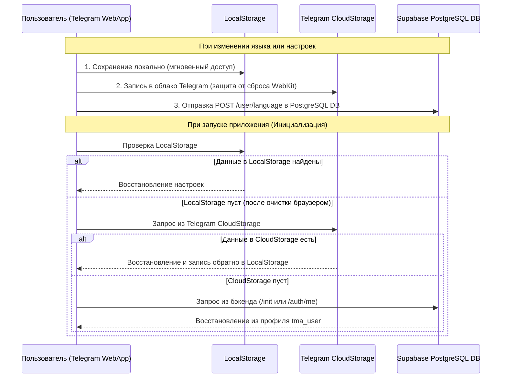

# 💾 Сохранение Данных и Устойчивость Хранилища

В данном документе описывается архитектура сохранения пользовательских данных, синхронизации и защиты от сброса сессий в **Lerne TMA**.

---

## 🏛 3-Уровневая Система Хранения Данных

Для гарантии сохранения настроек пользователя (в первую очередь выбранного языка обучения и авторизации) используется каскад из 3 уровней хранения:

---

## 🔍 Подробный разбор уровней

### 1. `LocalStorage` (Локальная память браузера)
- **Назначение**: Мгновенный доступ к данным без ожидания сетевых запросов.
- **Ограничение**: Во встроенном контейнере Telegram на мобильных устройствах (iOS WebKit / Android WebView) браузер может автоматически очищать `LocalStorage` при закрытии Mini App или нехватке RAM.

### 2. `Telegram.WebApp.CloudStorage` (Облачное хранилище Telegram)
- **Назначение**: Безопасное и постоянное хранение настроек в облаке Telegram, привязанное к Telegram ID пользователя.
- **Ключи**: `lerne_target_language`, `lerne_has_selected_language`.
- **Преимущество**: Данные **никогда не стираются** при закрытии приложения и синхронизируются между устройствами (телефон, планшет, ПК).

### 3. PostgreSQL База Данных (`tma_user`)
- **Назначение**: Централизованное хранилище в Supabase.
- **Поля профиля**: `active_language`, `has_selected_language`, `first_name`, `username`, `is_guest`.
- **Преимущество**: Позволяет серверным эндпоинтам (`/api/init`, `/api/decks`) сразу отдавать контент, отфильтрованный под выбранный язык пользователя.

---

## 🛡 Устойчивость Сетевых Запросов (Retry & Resilience)

Для защиты от "холодного старта" облачных функций Vercel и задержек подключения к Supabase PostgreSQL реализован встроенный механизм повторных попыток:

- **Функция**: `requestWithRetry` в `useAppInitialization.js`.
- **Логика**: При возникновении сетевого сбоя или задержки подключение повторно запрашивается до 3 раз с экспоненциальной задержкой.
- **Результат**: Пользователь не видит ошибок «Не удалось загрузить данные» при временных колебаниях сети.
