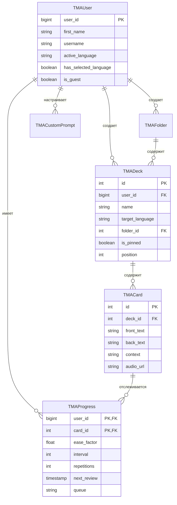

# 📐 Архитектура БД и 3-Уровневой Системы Хранения

Техническая спецификация базы данных PostgreSQL Supabase и каскадной системы хранения состояния пользователя в Telegram Mini App.

---

## 🗄 Схема Сборки Базы Данных в Supabase (PostgreSQL)

---

## 🔄 Механизм Каскадного Хранения (Cascading Storage)

Для предотвращения потери состояния выбранного языка во встроенном WebKit браузере Telegram применён каскад из трёх связанных слоёв:

1. **Слой 1 — Client `LocalStorage`**:
   - Чтение происходит мгновенно в синхронном режиме.
   - Запись выполняется при любом изменении через `localStorage.setItem()`.

2. **Слой 2 — Telegram `CloudStorage API`**:
   - Вызывается при отсутствии данных в `LocalStorage` или при первом старте.
   - Запись осуществляется через `window.Telegram.WebApp.CloudStorage.setItem()`.
   - Гарантирует сохранение между сессиями во встроенном контейнере Telegram iOS/Android.

3. **Слой 3 — PostgreSQL Backend Database**:
   - Фиксируется на сервере при вызове `POST /user/language` или `/auth/sync`.
   - Запрашивается бэкендом при консолидированной инициализации `/api/init`.
