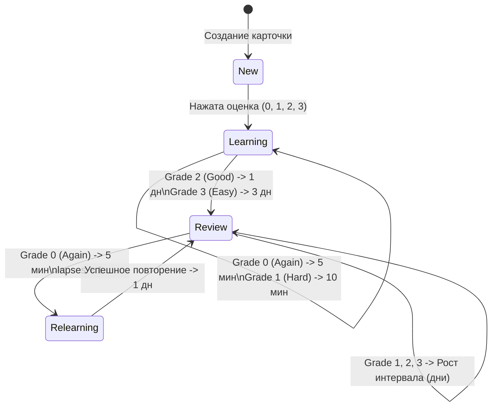

# Архитектура и Руководство: Система Интервального Повторения (SRS SM-2 PRO)

## 1. Обзор архитектуры

В **Lerne TMA** реализована гибридная система интервального повторения (**Spaced Repetition System — SRS**) на базе модифицированного алгоритма **SuperMemo-2 (SM-2 PRO)**.

Система построена по принципу **Dual-Engine (Двойного движка)**:
1. **Серверный движок (Python / FastAPI):** [`api/srs.py`](file:///C:/121/Lerne_projekt/tma/api/srs.py) — рассчитывает интервалы и обновляет состояние в базе данных PostgreSQL (Supabase) при обычном онлайн-изучении.
2. **Клиентский офлайн-движок (JavaScript / Dexie):** [`app/src/utils/srsEngine.js`](file:///C:/121/Lerne_projekt/tma/app/src/utils/srsEngine.js) — полностью зеркалирует математику сервера в браузере (IndexedDB) и в Android-приложении (Capacitor) при отсутствии связи.

---

## 2. Модели данных

### База данных сервера (`TMAProgress` & `TMAReviewHistory` в `models.py`)

```python
class TMAProgress(BaseModel):
    id = AutoField()
    card_id = IntegerField(index=True)      # ID карточки
    user_id = BigIntegerField(index=True)   # Telegram ID пользователя
    queue = CharField(default='new')        # Очередь: 'new', 'learning', 'review', 'relearning'
    interval = IntegerField(default=0)      # Текущий интервал (в минутах для learning, в днях для review)
    ease_factor = FloatField(default=2.5)   # Фактор легкости (множитель SM-2, диапазон: 1.3 - 3.0)
    repetitions = IntegerField(default=0)   # Общее число успешных повторений
    lapses = IntegerField(default=0)        # Количество ошибок (нажатий "Снова")
    step_index = IntegerField(default=0)    # Индекс текущего шага в очереди learning
    next_review = DateTimeField(null=True)  # Дата и время следующего повторения
    last_reviewed = DateTimeField(null=True)# Дата последнего ответа
```

Каждая оценка фиксируется в `TMAReviewHistory` для построения аналитики:
```python
class TMAReviewHistory(BaseModel):
    id = AutoField()
    card_id = IntegerField(index=True)
    user_id = BigIntegerField(index=True)
    rating = IntegerField()                 # 0: Again, 1: Hard, 2: Good, 3: Easy
    review_time = DateTimeField()           # Время ответа
    scheduled_interval = IntegerField()     # Назначенный интервал
```

---

## 3. Фазы жизненного цикла карточки (Queues)



1. **`new` (Новая):** Карточка создана, но пользователь еще ни разу ее не учил.
2. **`learning` (Первичное изучение):** Шаги `[5 мин, 10 мин]`. Карточка остается в пределах текущей сессии.
3. **`review` (Интервальное повторение):** Карточка выпущена в долговременную память (интервал измеряется в днях).
4. **`relearning` (Переучивание после ошибки):** Шаг `[5 мин]`. Если пользователь забыл карточку из `review`, она возвращается на краткий повтор.

---

## 4. Математика и алгоритмы SM-2 PRO

### Константы
* `INITIAL_EASE_FACTOR = 2.5` (Начальный фактор легкости)
* `MINIMUM_EASE_FACTOR = 1.3` (Минимальный порог легкости)
* `MAXIMUM_EASE_FACTOR = 3.0` (Максимальный порог легкости)
* `HARD_MULTIPLIER = 1.15` (Множитель для оценки "Трудно")
* `EASY_MULTIPLIER = 1.30` (Множитель бонуса для оценки "Легко")
* `LEECH_LAPSE_THRESHOLD = 5` (Порог ошибок для сложных карточек)

---

### Обработка оценок в очереди `review`:

#### 1. Оценка 0: `Again` (Снова)
* **Очередь:** переходит в `relearning` с шагом 5 минут.
* **Счетчик ошибок:** `lapses += 1`.
* **Защита от ловушки сложности (Anti Ease-Hell):**
  * Если карточка была просрочена более чем на 7 дней: штраф `ease_factor -= 0.15` (забывание после долгой паузы естественно).
  * Если повторение было вовремя: `ease_factor -= 0.20`.
  * `ease_factor = max(1.3, ease_factor)`.

#### 2. Оценка 1: `Hard` (Трудно)
* **Интервал:** `new_interval = round(max(interval + 1, interval * 1.15))`.
* **Ease factor:** `ease_factor = max(1.3, ease_factor - 0.15)`.
* Применяется Fuzzing.

#### 3. Оценка 2: `Good` (Хорошо)
* **Учет задержки:** `due_bonus = min(days_since_due / 2, interval * 0.5)`.
* **Интервал:** `new_interval = round(max(interval + 1, (interval + due_bonus) * ease_factor))`.
* **Ease Recovery:** Если `ease_factor < 2.5`, он слегка восстанавливается: `ease_factor = min(3.0, ease_factor + 0.02)`.
* Применяется Fuzzing.

#### 4. Оценка 3: `Easy` (Легко)
* **Учет задержки:** `due_bonus = min(days_since_due, interval * 1.0)`.
* **Интервал:** `new_interval = round(max(interval + 2, (interval + due_bonus) * ease_factor * 1.30))`.
* **Ease Recovery:** `ease_factor = min(3.0, ease_factor + 0.15)`.
* Применяется Fuzzing.

---

### 🎲 Размытие интервалов (Fuzzing)

Для предотвращения «лавин повторений» (когда десятки выученных в один день карточек возвращаются одновременно) при сохранении оценки добавляется случайный сдвиг:

| Интервал (дней) | Алгоритм сдвига | Диапазон результата |
| :--- | :--- | :--- |
| **$< 3$ дней** | Без размытия | Точно 1 или 2 дня |
| **$3 .. 7$ дней** | Сдвиг на $\pm 1$ день случайно: `random.choice([-1, 0, 1])` | $2 .. 8$ дней |
| **$8 .. 30$ дней** | Сдвиг на $\pm 10\%$ (минимум $\pm 1$ день) | Пример для 14 дн: $13 .. 15$ дн |
| **$> 30$ дней** | Сдвиг на $\pm 5\%$ (минимум $\pm 2$ дня) | Пример для 60 дн: $57 .. 63$ дн |

> **Примечание:** На кнопках интерфейса отображается стабильное базовое превью интервала, а случайный Fuzz применяется только в момент записи в БД.

---

### ⚠️ Детекция «Личей» (Leech Detection)

Если пользователь допустил на карточке 5 или более ошибок (`lapses >= 5`):
* Сервер и клиент возвращают `is_leech: true`.
* В интерфейсе карточки (`StudyCard.jsx`) отображается предупреждающий бейдж ⚠️ **«Сложная карточка (X ошибок)»**.
* Пользователю дается визуальный сигнал переформулировать карточку, добавить контекст или мнемонику.

---

## 5. Офлайн-режим и Синхронизация

1. **Локальное хранилище (Dexie.js / IndexedDB):**
   * Таблица `progress` с композитным ключом `[card_id+user_id]`.
   * При выставлении оценки без сети [`offlineApi.js`](file:///C:/121/Lerne_projekt/tma/app/src/services/offlineApi.js) перехватывает запрос и вызывает [`srsEngine.js`](file:///C:/121/Lerne_projekt/tma/app/src/utils/srsEngine.js).
   * Запись сохраняется в IndexedDB с флагом `is_dirty: 1`.
2. **Автоматическая синхронизация ([`syncService.js`](file:///C:/121/Lerne_projekt/tma/app/src/services/syncService.js)):**
   * При восстановлении соединения все `is_dirty` записи пакетом отправляются на эндпоинт `POST /sync/push`.
   * В ответ сервер возвращает актуальные обновления `GET /sync/pull`.

---

## 6. Пользовательский интерфейс и Аналитика

1. **Экран обучения (`StudyCard.jsx` & `GradeButtons.jsx`):**
   * Динамическое отображение прогнозируемых интервалов на 4 кнопках (`5 мин`, `10 мин`, `1 дн`, `3 дн`, `12 дн`, `1.5 мес`).
   * Индикатор сложных карточек (Leech Badge).
2. **Модальное окно аналитики SRS (`SrsStatsModal.jsx`):**
   * Доступно в профиле пользователя (`ProfileTab.jsx`).
   * **Retention Rate (30 дней):** процент успешных ответов (*Good + Easy*) из `TMAReviewHistory`.
   * **Зрелость памяти:**
     * 🌟 **Освоены (Mature):** интервал $\ge 21$ день (золотой цвет).
     * 🟩 **Закрепляются (Young):** интервал $< 21$ день (зеленый цвет).
     * 🟦 **В процессе (Learning):** фаза обучения (синий цвет).
     * ⬜ **Новые (New):** еще не начаты (серый цвет).
     * 🟧 **Сложные (Leech):** $\ge 5$ ошибок (красный цвет).
   * **Прогноз повторений на 7 дней:** столбчатая диаграмма распределения нагрузки по дням недели.

---

## 7. Файловая карта компонентов SRS

| Файл | Назначение |
| :--- | :--- |
| [`api/srs.py`](file:///C:/121/Lerne_projekt/tma/api/srs.py) | Серверное ядро SM-2 PRO: формулы, Fuzzing, Leech check, интервалы |
| [`api/routers/study.py`](file:///C:/121/Lerne_projekt/tma/api/routers/study.py) | Эндпоинты `/study/card/:id`, `/study/grade`, `/study/stats` |
| [`api/services/cards.py`](file:///C:/121/Lerne_projekt/tma/api/services/cards.py) | Выбор следующей карточки по SRS-очереди, форматирование |
| [`app/src/utils/srsEngine.js`](file:///C:/121/Lerne_projekt/tma/app/src/utils/srsEngine.js) | Офлайн клиентское ядро SM-2 PRO (зеркало Python-логики) |
| [`app/src/services/offlineApi.js`](file:///C:/121/Lerne_projekt/tma/app/src/services/offlineApi.js) | Офлайн-обработчик оценок и локальной аналитики из IndexedDB |
| [`app/src/components/study/StudyCard.jsx`](file:///C:/121/Lerne_projekt/tma/app/src/components/study/StudyCard.jsx) | Карточка с отображением Leech-бейджа и медиа |
| [`app/src/components/study/GradeButtons.jsx`](file:///C:/121/Lerne_projekt/tma/app/src/components/study/GradeButtons.jsx) | Кнопки 4 оценок с интервалами |
| [`app/src/components/study/SrsStatsModal.jsx`](file:///C:/121/Lerne_projekt/tma/app/src/components/study/SrsStatsModal.jsx) | Модальное окно SRS-аналитики (Retention Rate, прогноз 7 дней) |
| [`app/src/components/settings/ProfileTab.jsx`](file:///C:/121/Lerne_projekt/tma/app/src/components/settings/ProfileTab.jsx) | Точка входа в аналитику SRS в профиле |
| [`api/scratch/test_srs_engine.py`](file:///C:/121/Lerne_projekt/tma/api/scratch/test_srs_engine.py) | Unit-тесты для автоматической проверки математики алгоритма |
